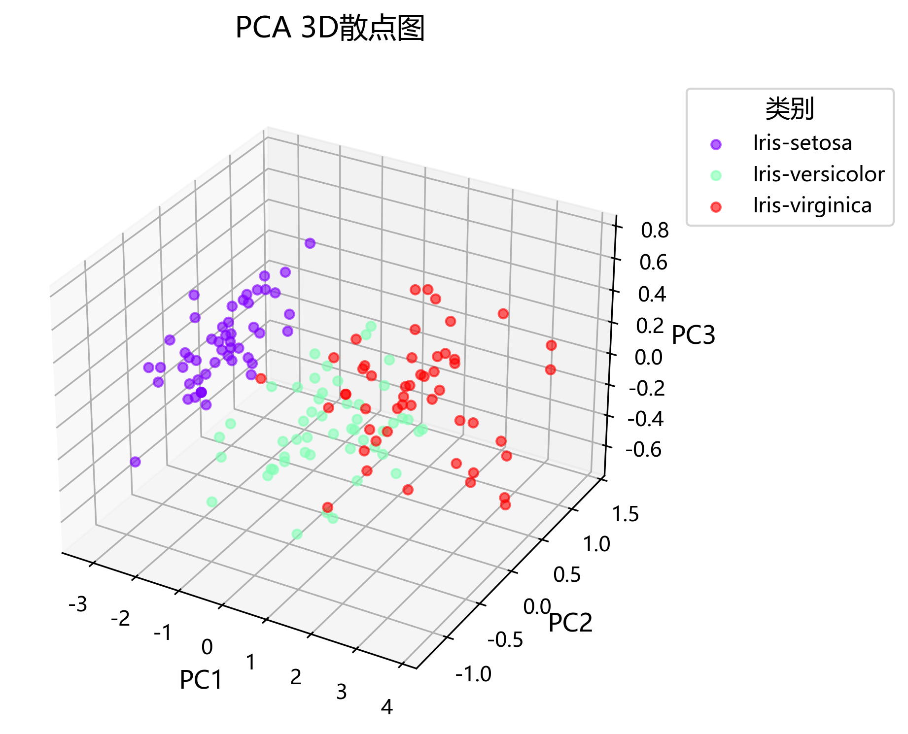
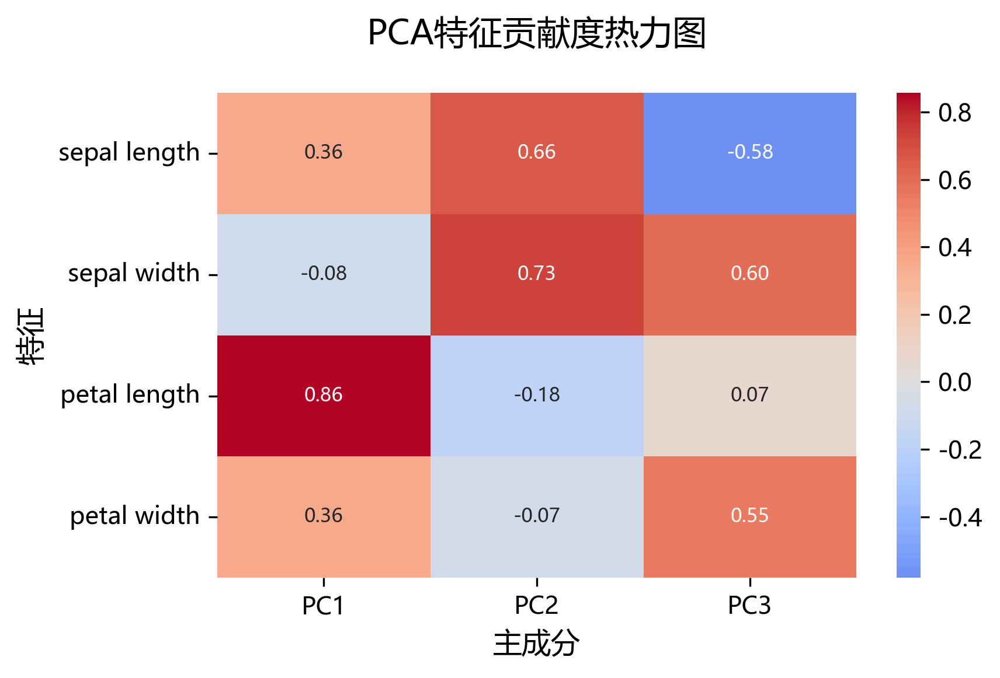
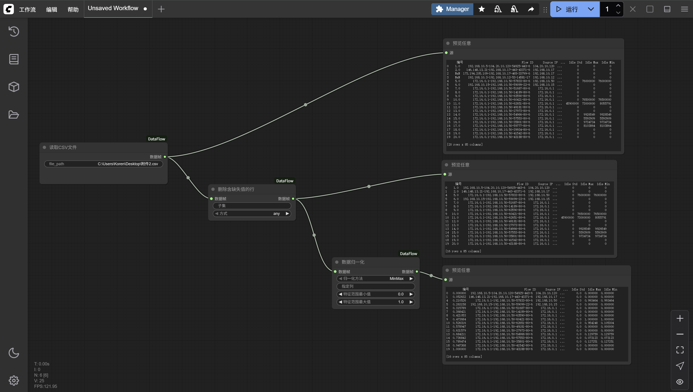
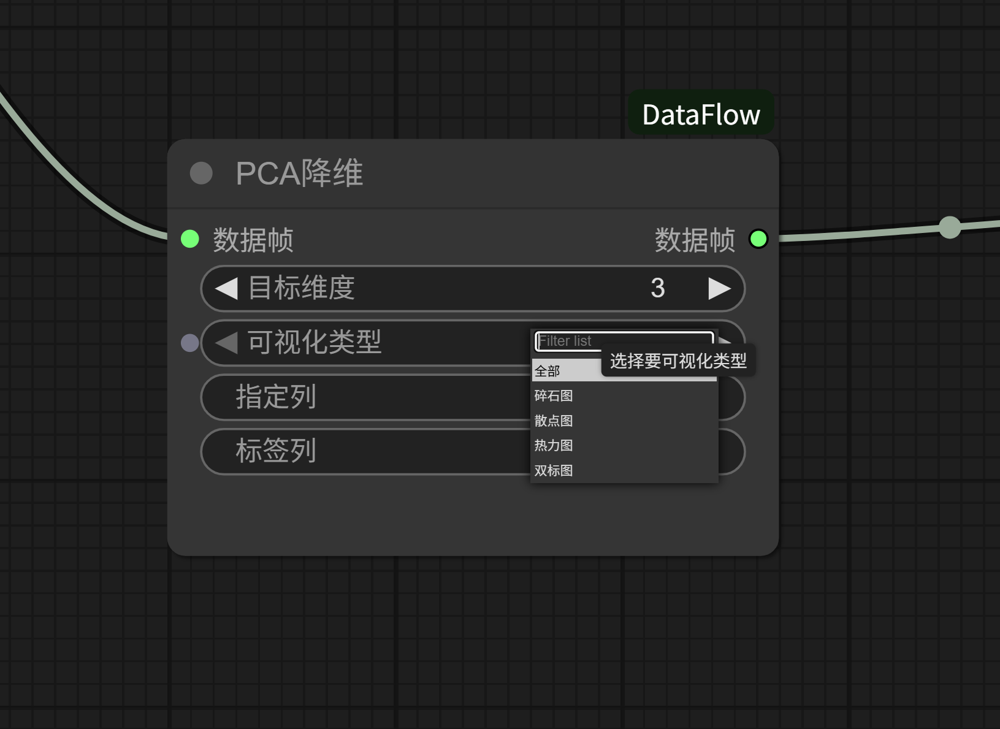
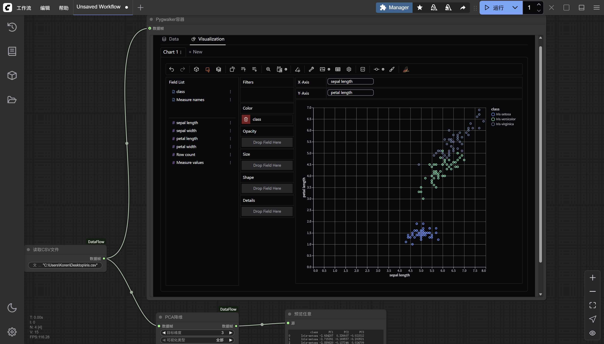
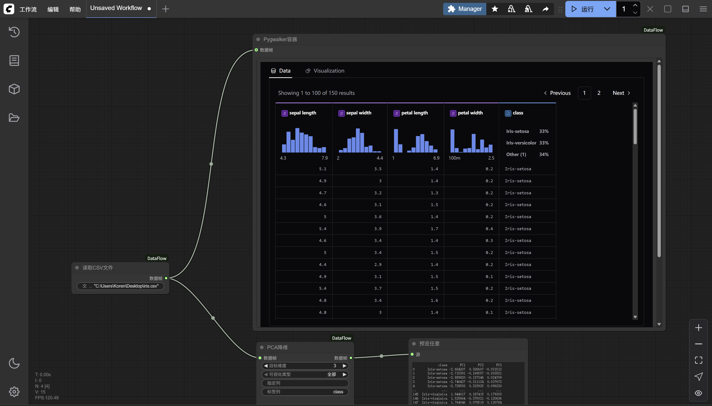
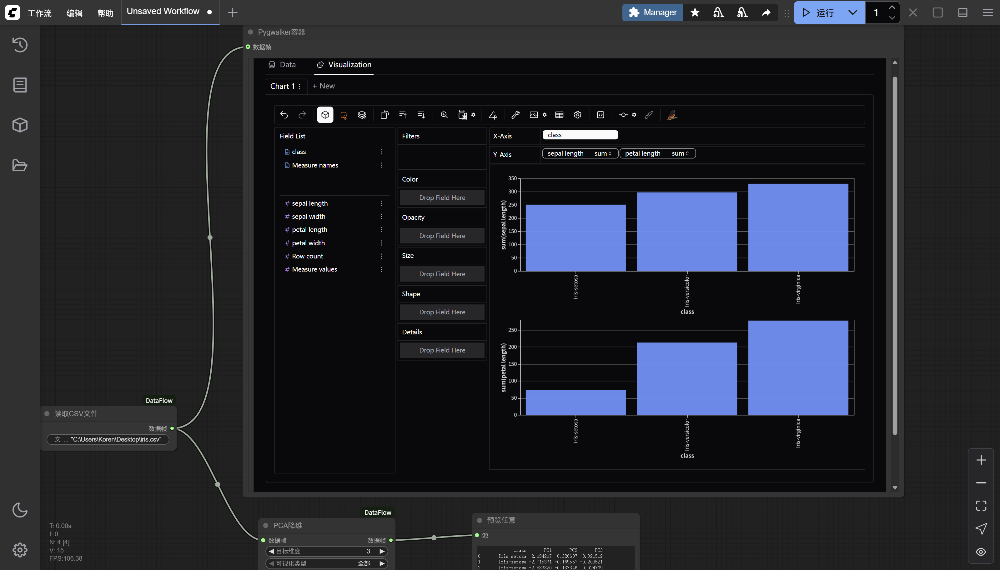

# DataFlow

[](https://opensource.org/licenses/MIT)
[](https://www.python.org/downloads/)
[](https://github.com/comfyanonymous/ComfyUI)

一个专为快速数学建模和数据科学工作流设计的高性能ComfyUI节点包。DataFlow提供了完整的数据处理管道，从数据采集到可视化分析的全流程解决方案。

目前本地的测试版本添加了很多东西，但作者学业繁忙，之后再整理保证稳定后上传。

## 🚀 核心特性

### 数据处理能力
- **数据采集**: 支持CSV文件读取，自动类型推断
- **数据清洗**: 智能处理缺失值、无穷值和异常数据
- **数据预处理**: 多种标准化和归一化方法
- **特征选择**: 灵活的列选择和特征工程

### 机器学习算法
- **降维算法**: PCA主成分分析、UMAP非线性降维
- **数据平衡**: 处理不平衡数据集的多种策略
- **可视化分析**: 多维数据的2D/3D可视化展示

### 可视化组件
- **交互式图表**: 基于Plotly的动态可视化
- **统计图表**: 散点图、热力图、碎石图等
- **Web组件**: Pygwalker、Streamlit集成
- **DOM容器**: 自定义HTML展示

<div align="center">
  
  
</div>

*左：3D散点图可视化 | 右：相关性热力图*

## 📦 快速安装

### 前置要求
- Python 3.8+
- ComfyUI (最新版本)
- 8GB+ RAM (推荐)

### 方法一：通过ComfyUI-Manager安装（推荐）

1. 安装 [ComfyUI](https://docs.comfy.org/get_started)
2. 安装 [ComfyUI-Manager](https://github.com/ltdrdata/ComfyUI-Manager)
3. 在ComfyUI-Manager中搜索"DataFlow"并安装
4. 重启ComfyUI

### 方法二：手动安装

```bash
# 克隆仓库到ComfyUI自定义节点目录
cd ComfyUI/custom_nodes
git clone https://github.com/Koren-cy/DataFlow.git
cd DataFlow

# 安装依赖
pip install -e .

# 重启ComfyUI
```

## 🎯 快速开始

### 基础数据处理工作流

1. **数据读取**: 使用`ReadCSV`节点加载数据
2. **数据清洗**: 连接`DropNA`和`DropINF`节点
3. **数据标准化**: 使用`Normalize`节点
4. **结果展示**: 连接`ShowAny`节点查看结果


*完整的数据处理工作流示例*

### 降维分析工作流

1. **数据预处理**: ReadCSV → DropNA → Normalize
2. **降维分析**: 连接`PCA`或`UMAP`节点
3. **可视化**: 自动生成多种图表
4. **结果导出**: 获取降维后的数据


*PCA降维分析节点配置*

## 📚 节点参考

### 数据采集类

| 节点名称 | 功能描述 | 输入类型 | 输出类型 |
|---------|----------|----------|----------|
| ReadCSV | 读取CSV文件 | STRING | DATAFRAME |

### 数据处理类

| 节点名称 | 功能描述 | 输入类型 | 输出类型 |
|---------|----------|----------|----------|
| DropNA | 删除缺失值行 | DATAFRAME | DATAFRAME |
| DropINF | 删除无穷值行 | DATAFRAME | DATAFRAME |
| Normalize | 数据标准化 | DATAFRAME | DATAFRAME |
| SelectColumns | 选择指定列 | DATAFRAME | DATAFRAME |
| BalanceData | 数据平衡处理 | DATAFRAME | DATAFRAME |

### 机器学习类

| 节点名称 | 功能描述 | 输入类型 | 输出类型 |
|---------|----------|----------|----------|
| PCA | 主成分分析降维 | DATAFRAME | DATAFRAME |
| UMAP | 非线性降维 | DATAFRAME | DATAFRAME |

### 可视化类

| 节点名称 | 功能描述 | 输入类型 | 输出类型 |
|---------|----------|----------|----------|
| ShowAny | 文本格式展示 | ANY | - |
| ShowDOM | DOM容器展示 | ANY | - |
| ShowPygwalker | 交互式数据探索 | DATAFRAME | - |
| ShowStreamlit | Streamlit应用 | ANY | - |

<div align="center">
  
  
  
</div>

*多种可视化节点的输出效果展示*

## 🔧 开发指南

### 开发环境设置

```bash
# 克隆开发版本
git clone https://github.com/Koren-cy/DataFlow.git
cd DataFlow

# 安装开发依赖
pip install -e .[dev]

# 安装pre-commit钩子
pre-commit install
```

### 代码规范

- 使用 `ruff` 进行代码格式化和静态检查
- 使用 `mypy` 进行类型检查
- 遵循 PEP 8 编码规范
- 所有公共函数需要类型注解和文档字符串

### 测试

```bash
# 运行所有测试
pytest

# 运行测试并生成覆盖率报告
pytest --cov=src

# 运行特定测试
pytest tests/test_nodes.py
```

### 添加新节点

1. 在 `src/Nodes/` 目录下创建新的Python文件
2. 实现节点类，遵循ComfyUI节点规范
3. 在 `src/nodes.py` 中注册新节点
4. 添加相应的测试用例
5. 更新文档

## 📊 性能基准

| 操作 | 数据量 | 处理时间 | 内存占用 |
|------|--------|----------|----------|
| CSV读取 | 100万行 | ~2秒 | ~500MB |
| PCA降维 | 10万行×100列 | ~5秒 | ~800MB |
| UMAP降维 | 5万行×50列 | ~30秒 | ~1GB |
| 数据清洗 | 100万行 | ~1秒 | ~200MB |

*测试环境: Intel i7-10700K, 32GB RAM, Python 3.9*

## 🤝 贡献指南

我们欢迎社区贡献！请遵循以下步骤：

1. Fork 本仓库
2. 创建特性分支 (`git checkout -b feature/AmazingFeature`)
3. 提交更改 (`git commit -m 'Add some AmazingFeature'`)
4. 推送到分支 (`git push origin feature/AmazingFeature`)
5. 开启 Pull Request

### 贡献类型

- 🐛 Bug修复
- ✨ 新功能开发
- 📚 文档改进
- 🎨 UI/UX优化
- ⚡ 性能优化
- 🧪 测试用例

## 📄 许可证

本项目采用 MIT 许可证 - 查看 [LICENSE](LICENSE) 文件了解详情。

## 🆘 支持与反馈

- **问题报告**: [GitHub Issues](https://github.com/Koren-cy/DataFlow/issues)
- **功能请求**: [GitHub Discussions](https://github.com/Koren-cy/DataFlow/discussions)
- **邮件联系**: koren.cai.cy@gmail.com
- **ComfyUI社区**: [Discord](https://discord.com/invite/comfyorg)

## 🙏 致谢

- [ComfyUI](https://github.com/comfyanonymous/ComfyUI) - 强大的节点编辑器框架
- [scikit-learn](https://scikit-learn.org/) - 机器学习算法库
- [pandas](https://pandas.pydata.org/) - 数据处理库
- [plotly](https://plotly.com/) - 交互式可视化库

---

<div align="center">
  <strong>DataFlow - 让数据科学工作流更简单</strong>
</div>

